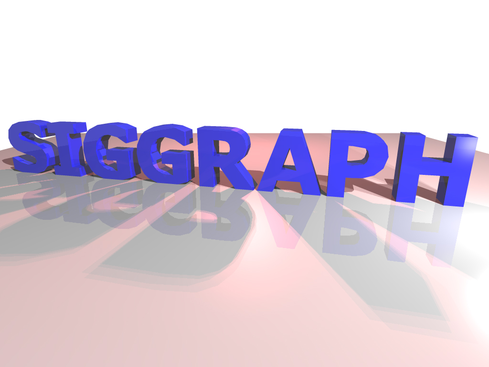
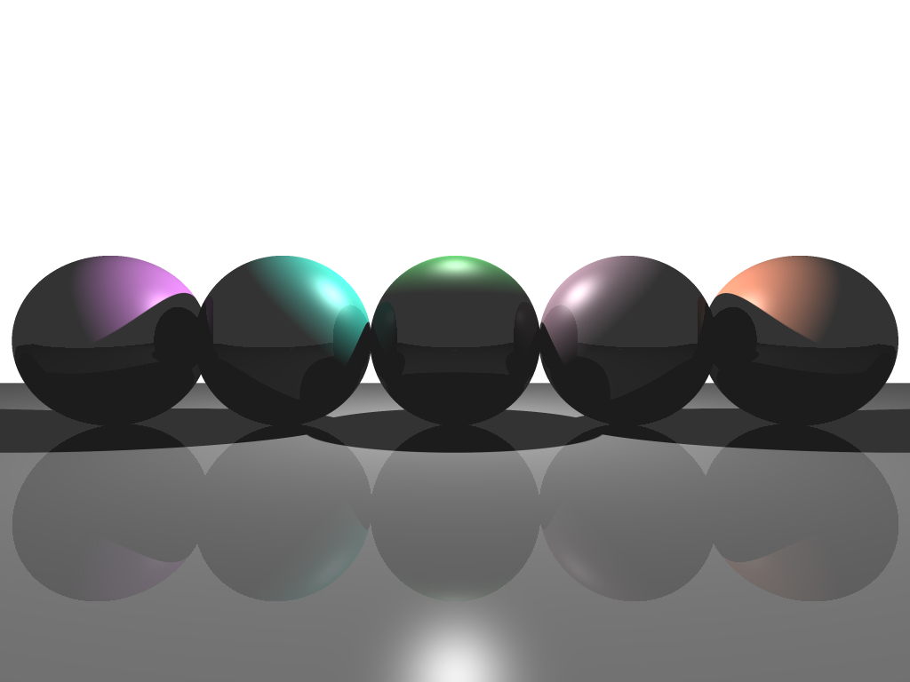
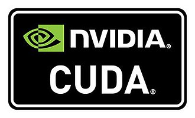
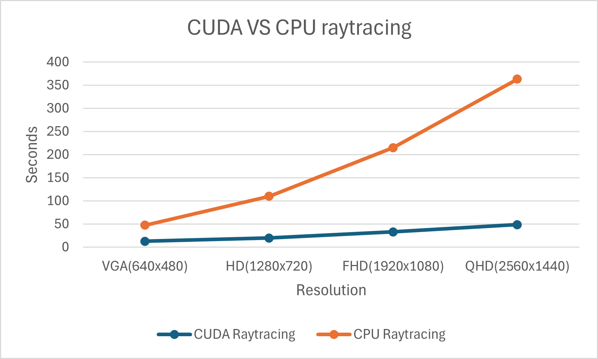
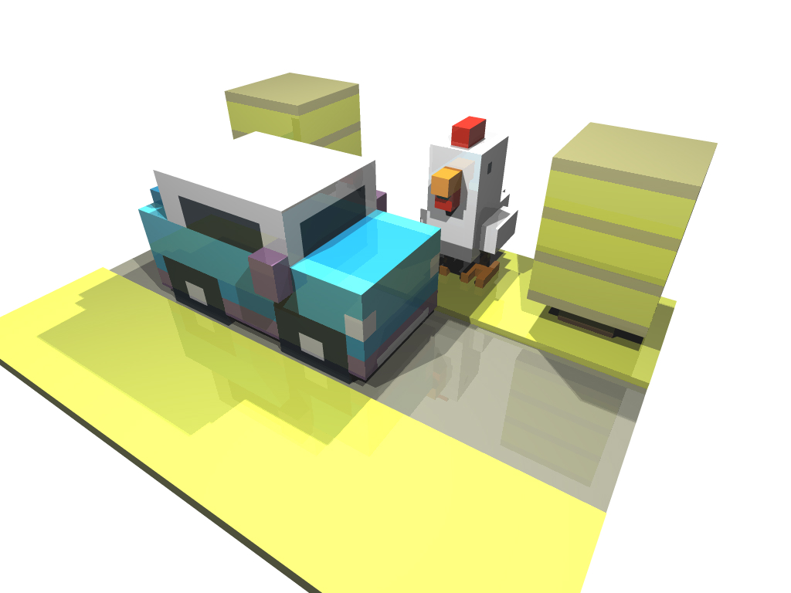
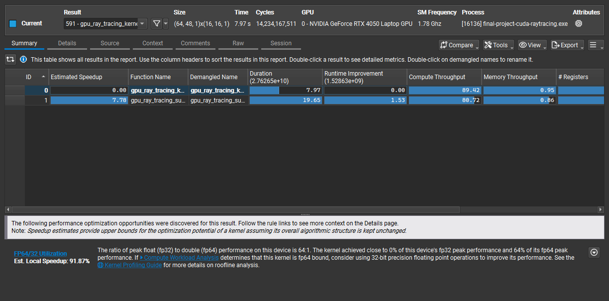
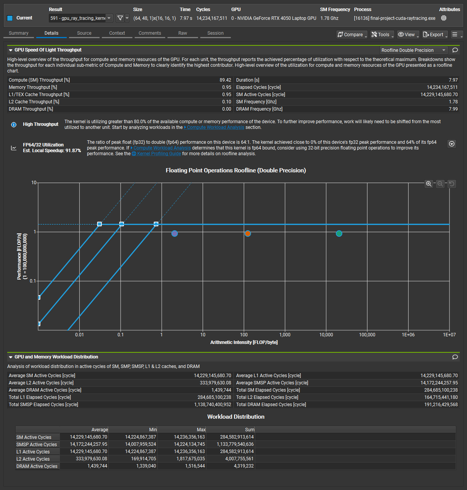
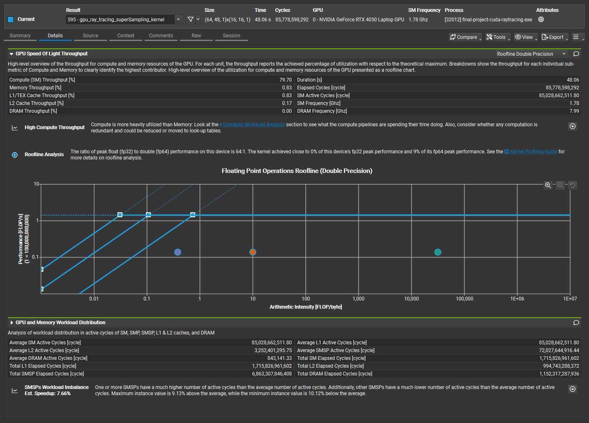
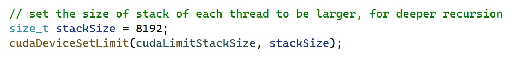

# CSCI596-CUDA-Raytracing
## Xinjie Zhu's final project of CSCI 596

### What is ray tracing?
Ray tracing is a computer graphics technique to create more realistic and beautiful images.
It imagines how the rays travel and bounce in the scene, and determine the color for each pixel, to show how light works on objects.

Example result 1:

  

Example result 2:

  

### Why ray tracing is used?
Ray tracing is used because it makes images look incredibly realistic. 
It can simulate the lighting effects in the real life, like reflections (mirrors), translucency (frosted glass), caustics, soft shadow and so on. 

### Why using CUDA for ray tracing?
CUDA enables parallelization on GPU. Two subquestion: why parallelization and why GPU.  

Why parallelizing, because ray tracing shoots the ray and runs the algotithm independently for each individual pixel, and therefore is good for parallelizing. 

Why running on GPU not CPU, because GPUs have thousands of cores optimized for handling many rays simultaneously, far more efficient than CPUs with fewer, general-purpose cores like those used in OpenMP. 

### Running time comparison between CUDA ray tracing and CPU ray tracing

The rendering result of "toy" scene used for runnning time comparison

### Performance anaylsis
Using Nvidia Nsight Compute to make the performance and roofline analysis for the CUDA ray tracing program  

  

Summary for two kernals

Roofline chart for major raytracing kernal  
The function points are very close to the roofline, showing the high performance for this kernal

Roofline chart for the minor kernal (for super sampling)  
There are if statements inside this kernal, and not all the threads in one warp do the same operation, causing warp divergence and bottleneck for this kernal. Need optimization.

### Problem Solved
When implementing the reflection feature of ray tracing, the ray tracing kernal (running on each pixel) needs to recursively call the device function "ray_tracing". However, when the depth of recursion larger than 2, there is a CUDA error "an illegal memory access was encountered" reported by "cudaGetLastError" function. The program only works when the depth is 1 or 2, but such shallow recursion may let the reflection effect not refined. 

The reason why this problem occurs is that the stack size of each thread (pixel) is too small (1KB for default). The solution is that calling the function "cudaDeviceSetLimit" before launching the kernal, to increase the stack size from 1KB to 4KB or 8KB. Then the kernal can run the recursion of device function with more depth, even larger than 5.  

According to the code snippet, the first parameter is the enum type value "cudaLimitStackSize", showing that the kind of limit that to be set is stack size. The second parameter is the size you want to set. 
 

### Future Work
Based on the performance roofline analysis, the supersampling kernal should be optimized by avoiding the if statement and warp divergence. 

GPU programming only allows shallow recursions, causing the reflections not refined. I have used cudaDeviceSetLimit to enhance the stack size for each thread, so that the recursion with more depth can be done in the kernal.
But setting the stack size too high may have some effect on performance. So the code can be further improved to allow the recursion for more depth. 